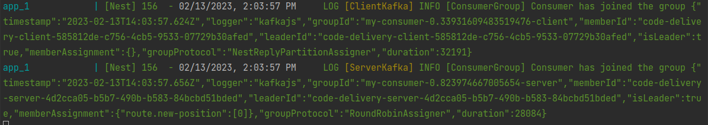

<p align="center">
  <a href="#-tecnologias">Tecnologias</a>&nbsp;&nbsp;&nbsp;|&nbsp;&nbsp;&nbsp;
  <a href="#-projeto">Projeto</a>&nbsp;&nbsp;&nbsp;|&nbsp;&nbsp;&nbsp;
  <a href="#-como-rodar">Como rodar</a>&nbsp;&nbsp;&nbsp;|&nbsp;&nbsp;&nbsp;
  <a href="#-rotas">Rotas</a>&nbsp;&nbsp;&nbsp;|&nbsp;&nbsp;&nbsp;
  <a href="#-como-contribuir">Como contribuir</a>&nbsp;&nbsp;&nbsp;
  </p>

<br>

## Full Cycle - Simulador Go

<p align="center">
  
</p>

## 🚀 Tecnologias

Esse projeto foi desenvolvido com as seguintes tecnologias:

- [NodeJS](https://nodejs.org/en/)
- [Docker](https://www.docker.com/)
- [NestJS](https://nestjs.com/)

## 💻 Projeto

Backend em NestJS.

[Simulador](https://github.com/jamangueira7/imersao-full-cycle-simulator-go)


## 🚀 Como Rodar

- Clone o projeto.
- crie um arquivo .env na raiz do projeto com os valores que estão em .env.example
- Entre na pasta do projeto e rode `docker-compose up -d`.

## 👩🏿‍💻 Rotas

- **`GET /routes`**: Rota todas as posiçẽos

Retorna:
```
[
    {
        "startPosition": {
            "lat": -15.82594,
            "lng": -47.92923
        },
        "endPosition": {
            "lat": -15.82942,
            "lng": -47.92765
        },
        "title": "Primeiro"
    },
    {
        "startPosition": {
            "lat": -15.82449,
            "lng": -47.92756
        },
        "endPosition": {
            "lat": -15.8276,
            "lng": -47.92621
        },
        "title": "Segundo"
    },
    {
        "startPosition": {
            "lat": -15.82331,
            "lng": -47.92588
        },
        "endPosition": {
            "lat": -15.82758,
            "lng": -47.92532
        },
        "title": "Terceiro"
    }
]
```

## 🤔 Como contribuir

- Faça um fork desse repositório;
- Cria uma branch com a sua feature: `git checkout -b minha-feature`;
- Faça commit das suas alterações: `git commit -m 'feat: Minha nova feature'`;
- Faça push para a sua branch: `git push origin minha-feature`.

Depois que o merge da sua pull request for feito, você pode deletar a sua branch.

## 📝 Licença

Esse projeto está sob a licença MIT.
